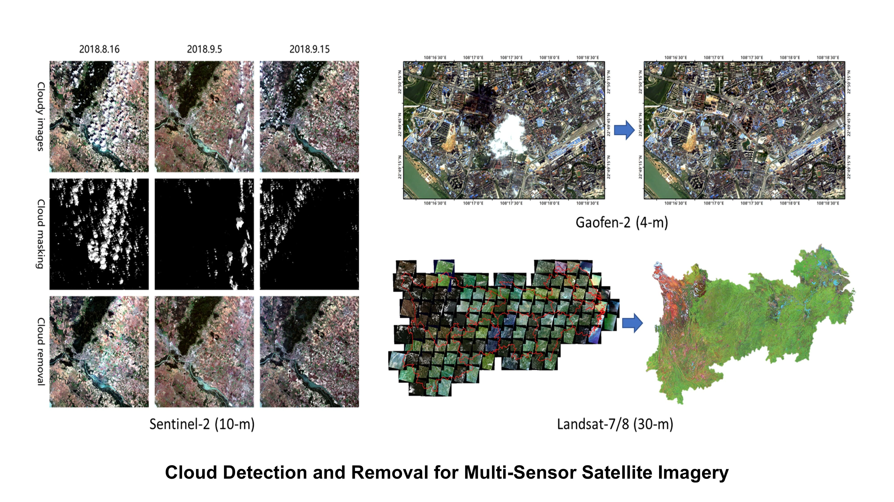

##### **Grants**  

- **PI**: The Hong Kong Polytechnic University, Near-Real-Time Flood Monitoring in Cloud-Prone Areas Incorporating Multi-Sensor Satellite Imagery, HKD 730,800, 02/2024-01/2026.  (Terminated)&emsp;
- **PI**: The Hong Kong Polytechnic University, Intelligent Reconstruction and Fusion of Multisource Remote Sensing Data for High-resolution Dynamic Land Use Mapping, HKD 250,000, 09/2022-08/2024.  &emsp;
- **PI**: National Natural Science Foundation of China (NSFC), Thick Cloud Processing Methods for Time-series Remote Sensing Images in Tensor Space,  CNY 300,000, 01/2022-12/2024.  &emsp;

##### **Research Interests**  

Remote Sensing of Cloudy and Rainy Environments:

- Cloud Detection and Removal

  

- Land Use & Land Cover Mapping

  

- Flood Monitoring and Risk Assessment

  

- Geospatial Artificial Intelligence

