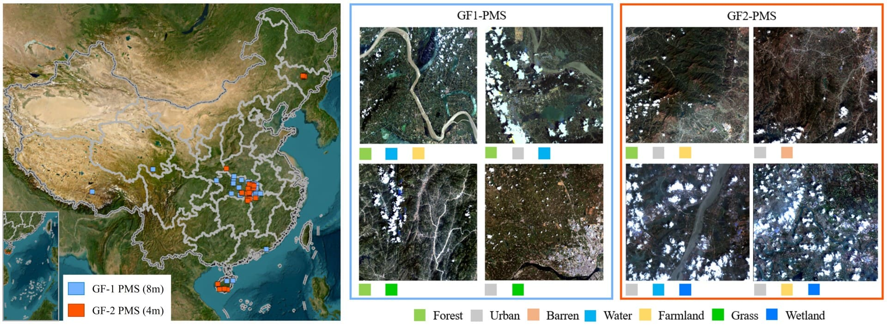

##### **Projects**  

**[1] OpenSICDR: Open Satellite Image Cloud Detection Resources ([Link](https://github.com/dr-lizhiwei/OpenSICDR)) **  
&emsp;We collect the latest open-source tools and datasets for cloud and cloud shadow detection, and launch this online project (Open Satellite Image Cloud Detection Resources, i.e., OpenSICDR) to promote the sharing of the latest research outputs of the field. If you would like to provide new resources, please kindly contact Dr. Zhiwei Li or submit an update request.  
&emsp;Reference: Zhiwei Li, Huanfeng Shen, Qihao Weng, Yuzhuo Zhang, Peng Dou, Liangpei Zhang. Cloud and cloud shadow detection for optical satellite imagery: Features, algorithms, validation, and prospects. *ISPRS Journal of Photogrammetry and Remote Sensing*, vol. 188, pp. 89-108, 2022. [[PDF](../assets/pdf/2022.6_ISPRS P&RS_Cloud and cloud shadow detection for optical satellite imagery：Features, algorithms, validation, and prospects.pdf)]  

------

##### **Datasets**  

**[1] GF1_WHU: GF-1 WFV Cloud and Cloud Shadow Detection Dataset ([Link](https://github.com/dr-lizhiwei/GF1_WHU/))**  
&emsp;The Gaofen-1 cloud and cloud shadow detection dataset, termed GF1_WHU, was created by researchers at Wuhan University. It has been used for the performance evaluation of cloud detection methods for Gaofen-1 WFV images, which have a 16-m spatial resolution and four multispectral bands spanning the visible to the near-infrared spectral regions. This data collection includes 108 Level2A scenes collected from different global land-cover types under varying cloud conditions. All associated reference masks label both cloud and cloud shadow. 

Global distribution of images in GF1_WHU dataset (base map credit: NASA Visible Earth)
  

**[2] HRC_WHU: High-resolution Cloud Detection Dataset ([Link](https://github.com/dr-lizhiwei/HRC_WHU))**  
&emsp;The high-resolution cloud detection dataset, termed HRC_WHU, comprises 150 high-resolution images acquired with three RGB channels and a resolution varying from 0.5 to 15 meters across different global regions. The images were collected from Google Earth, where satellite images, aerial photography, and geographic information system data are superimposed to map the Earth onto a 3D globe. The associated reference cloud masks were digitized by experts specializing in remote sensing image interpretation from Wuhan University.

Preview of images in HRC_WHU dataset

**[3] GF1MS_WHU & GF2MS-WHU: GF-1/2 PMS Cloud Detection Datasets ([Link](https://github.com/whu-ZSC/GF1-GF2MS-WHU/))** <i>**New**</i>

Two new datasets, GF1MS-WHU and GF2MS-WHU, are introduced for cloud detection. The GF1MS-WHU dataset consists of 141 unlabeled and 33 well-annotated 8-m Gaofen-1 PMS multispectral images. The acquisition of the images in the GF1MS-WHU dataset spanned from June 2014 to December 2020 and encompassed four multispectral bands in the GF-1 PMS imagery. Furthermore, the GF2MS-WHU dataset includes 163 unlabeled and 29 well-annotated 4-m Gaofen-2 multispectral images. The images in the GF2MS-WHU dataset were acquired from June 2014 to October 2020 and included four multispectral bands in the GF-2 PMS imagery. Based on the labeled images in the two datasets, a total of 10,428 and 21,917 fully labeled image patches have been made available.

Distribution and examples of well-annotated images in GF1MS-WHU and GF2MS-WHU datasets
  

------

##### **Code and Tools**

**[1] Software Tool for Cloud and Cloud Shadow Detection in GF-1 WFV Imagery ([Link](http://sendimage.whu.edu.cn/en/mfc/))**  
&emsp;Reference: Zhiwei Li, Huanfeng Shen, Huifang Li, Guisong Xia, Paolo Gamba, and Liangpei Zhang. Multi-feature combined cloud and cloud shadow detection in GaoFen-1 wide field of view imagery. *Remote Sensing of Environment*, vol. 191, pp. 342–358, 2017. [[PDF](../assets/pdf/2017.3_RSE_Multi-feature combined cloud and cloud shadow detection in GaoFen-1 wide field of view imagery)]  

**[2] Deep Learning based Cloud Detection for Images of Different Sensors ([Link](http://sendimage.whu.edu.cn/en/mscff/))**  
&emsp;Reference: Zhiwei Li, Huanfeng Shen, Qing Cheng, Yuhao Liu, Shucheng You, and Zongyi He. Deep learning based cloud detection for medium and high resolution remote sensing images of different sensors. *ISPRS Journal of Photogrammetry and Remote Sensing*, vol. 150, pp. 197–212, 2019. [[PDF](../assets/pdf/2019.4_ISPRS P&RS_Deep learning based cloud detection for medium and high resolution remote sensing images of different sensors.pdf)]  

**[3] Urban Water Extraction by Combining Deep Learning and Google Earth Engine ([GEE Code](https://code.earthengine.google.com/8bec5b26cc38bc4b812aa7b95a3ab8d6), [List of data](http://sendimage.whu.edu.cn/en/wp-content/uploads/2020/01/List_of_data.txt))**  
&emsp;Reference: Yudie Wang, Zhiwei Li, Chao Zeng, Gui-Song Xia, and Huanfeng Shen. An Urban Water Extraction Method Combining Deep Learning and Google Earth Engine. *IEEE Journal of Selected Topics in Applied Earth Observations and Remote Sensing*, vol. 13, pp. 768–781, 2020. [[PDF](../assets/pdf/2020.2_JSTARS_An Urban Water Extraction Method Combining Deep Learning and Google Earth Engine.pdf)]  