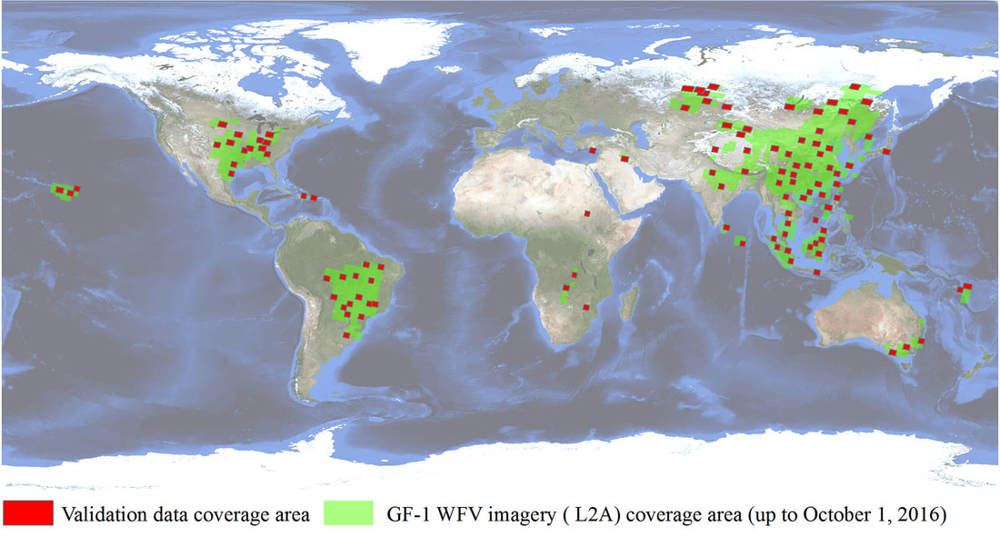
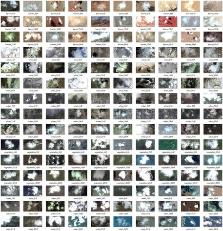

##### **Projects**  

**OpenSICDR: Open Satellite Image Cloud Detection Resources ([Link](https://github.com/dr-lizhiwei/OpenSICDR)]) [New]**  
&nbsp;&nbsp;&nbsp;&nbsp;We collects the latest open-source tools and datasets for cloud and cloud shadow detection and launches an online project (Open Satellite Image Cloud Detection Resources, i.e., OpenSICDR) to promote the sharing of the latest research outputs of the field. If you would like to provide new resources, please submit an update request.  
&nbsp;&nbsp;&nbsp;&nbsp;Reference: Zhiwei Li, Huanfeng Shen, Qihao Weng, Yuzhuo Zhang, Peng Dou, Liangpei Zhang. Cloud and cloud shadow detection for optical satellite imagery: Features, algorithms, validation, and prospects. *ISPRS Journal of Photogrammetry and Remote Sensing*, vol. 188, pp. 89-108, 2022. [[PDF](https://www.sciencedirect.com/science/article/pii/S0924271622000934)]  

------

##### **Datasets**  

**[1] GF1_WHU: GF-1 Cloud and Cloud Shadow Cover Validation Dataset ([Link](http://sendimage.whu.edu.cn/en/mfc-validation-data/))**  
&nbsp;&nbsp;&nbsp;&nbsp;The Gaofen-1 cloud and cloud shadow cover validation dataset termed GF1_WHU was created by Wuhan University, and has been used for the performance evaluation of cloud detection methods for Gaofen-1 WFV images, which has a 16-m spatial resolution and four multispectral bands spanning the visible to the near-infrared spectral regions. This collection of validation data includes 108 Level2A scenes collected from different global land-cover types with varying cloud conditions, and all the associated masks label both cloud and cloud shadow.  

Global distribution of images in GF1_WHU (base map credit: NASA Visible Earth)

**[2] HRC_WHU: High-resolution Cloud Cover Validation Dataset ([Link](http://sendimage.whu.edu.cn/en/hrc_whu/))**  
&nbsp;&nbsp;&nbsp;&nbsp;The high-resolution cloud cover validation dataset termed HRC_WHU data comprise 150 high-resolution images acquired with three RGB channels and a resolution varying from 0.5 to 15 m in different global regions. The images were collected from Google Earth (Google Inc.), in which satellite images, aerial photography, and geographic information system data are superimposed to map the Earth onto a 3D globe. The associated reference cloud masks were digitized by experts in the field of remote sensing image interpretation from Wuhan University.

Global distribution of images in GF1_WHU (base map credit: NASA Visible Earth)

------

##### **Code and Tools**

**[1] Software Tool for Cloud and Cloud Shadow Detection in GF-1 WFV Imagery ([Link](http://sendimage.whu.edu.cn/en/mfc/))**  
&nbsp;&nbsp;&nbsp;&nbsp;Reference: Zhiwei Li, Huanfeng Shen, Huifang Li, Guisong Xia, Paolo Gamba, and Liangpei Zhang. Multi-feature combined cloud and cloud shadow detection in GaoFen-1 wide field of view imagery. *Remote Sensing of Environment*, vol. 191, pp. 342–358, 2017. [[PDF](http://sendimage.whu.edu.cn/en/wp-content/uploads/2017/02/2017_RSE_Multi-feature-combined-cloud-and-cloud-shadow-detection-in-GaoFen-1-wide-field-of-view-imagery.pdf)]  

**[2] Deep Learning based Cloud Detection for Images of Different Sensors ([Link](http://sendimage.whu.edu.cn/en/mscff/))**  
&nbsp;&nbsp;&nbsp;&nbsp;Reference: Zhiwei Li, Huanfeng Shen, Qing Cheng, Yuhao Liu, Shucheng You, and Zongyi He. Deep learning based cloud detection for medium and high resolution remote sensing images of different sensors. *ISPRS Journal of Photogrammetry and Remote Sensing*, vol. 150, pp. 197–212, 2019. [[PDF](http://sendimage.whu.edu.cn/en/wp-content/uploads/2019/03/2019_PHOTO_Zhiwei-Li_Deep-learning-based-cloud-detection-for-medium-and-high-resolution-remote-sensing-images-of-different-sensors.pdf)]  

**[3] Urban Water Extraction by Combining Deep Learning and Google Earth Engine ([Code](https://code.earthengine.google.com/8bec5b26cc38bc4b812aa7b95a3ab8d6), [List of data](http://sendimage.whu.edu.cn/en/wp-content/uploads/2020/01/List_of_data.txt))**  
&nbsp;&nbsp;&nbsp;&nbsp;Reference: Yudie Wang, Zhiwei Li, Chao Zeng, Gui-Song Xia, and Huanfeng Shen. An Urban Water Extraction Method Combining Deep Learning and Google Earth Engine. *IEEE Journal of Selected Topics in Applied Earth Observations and Remote Sensing*, vol. 13, pp. 768–781, 2020. [[PDF](http://sendimage.whu.edu.cn/en/wp-content/uploads/2021/03/2020-An-Urban-Water-Extraction-Method-Combining-Deep-Learning-and-Google-Earth-Engine.pdf)]  