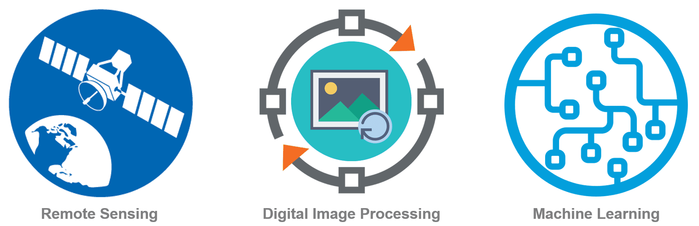

##### **Subject Lecturer**  

- 01/2023 - Present,  Graduate Subject, LSGI536, Remote Sensing Image Processing

##### **Teaching Assistant**  

- 09/2022 - Present, Undergraduate Subject, LSGI1001, Big Earth Data and Geospatial AI
- 08/2022, Training Course for Lands Department of Hong Kong Government, Remote Sensing and Machine Learning

